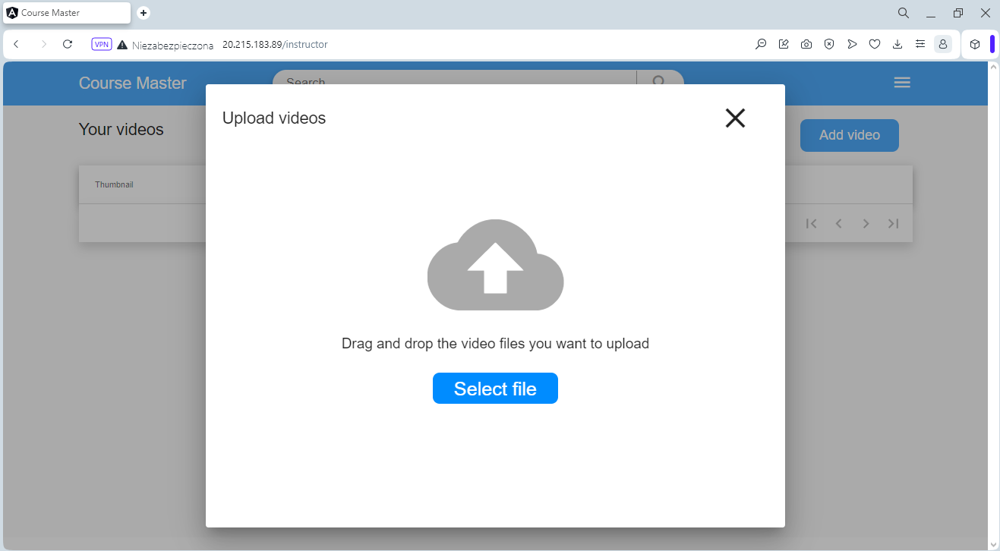
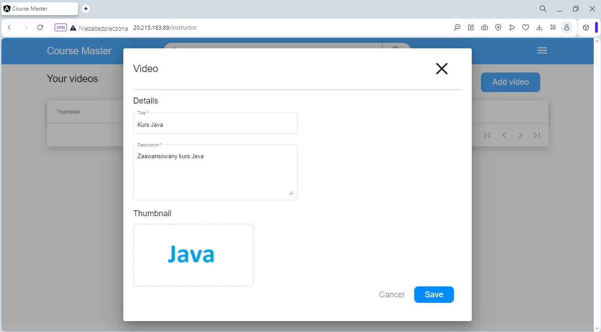
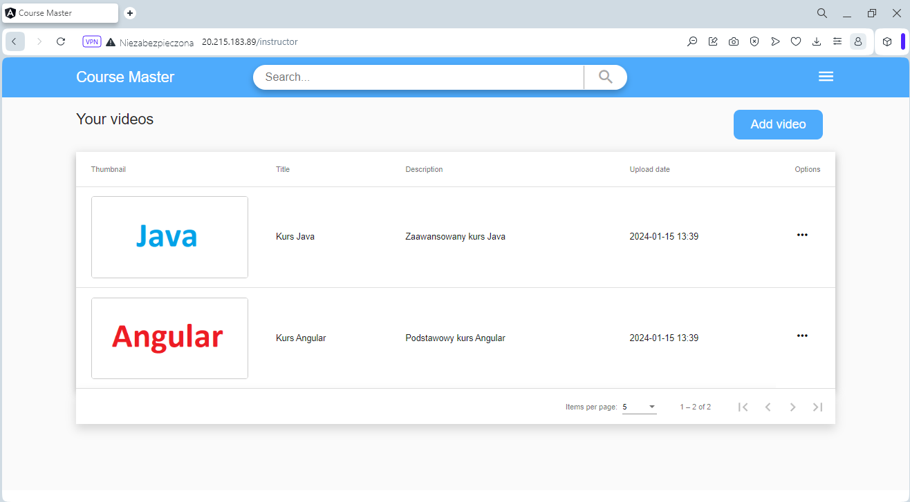
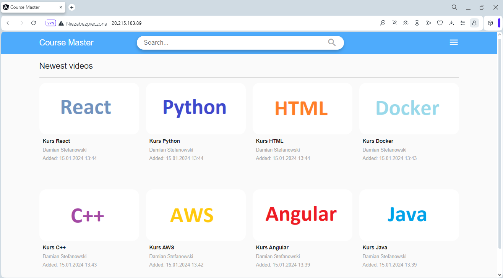
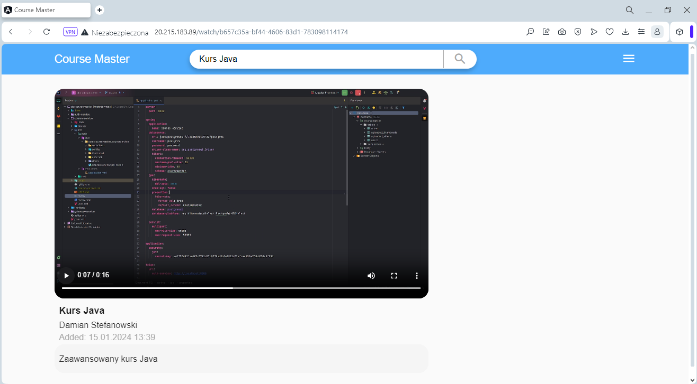

<div align="center">

# 🎓 Course Master

### A Modern E-Learning Platform built on Microservices Architecture

*Engineering Thesis Project - Full-Stack Application*


</div>

## 📌 About the Project

**DevCourseMaster** is a full-stack, production-inspired e-learning platform that allows users to browse, enroll in, and watch video courses. The project was designed and developed as an Engineering Thesis to demonstrate real-world software engineering practices.

The backend is split into independent **microservices** communicating through an **API Gateway**, with secure authentication handled via **OAuth2 + JWT**. The frontend is a responsive **Single Page Application** built with Angular 14.

---

## 🛠️ Technology Stack

| Layer | Technology |
|---|---|
| **Language** | Java 17, TypeScript |
| **Backend Framework** | Spring Boot 3.x |
| **Gateway** | Spring Cloud Gateway |
| **Security** | Spring Security, OAuth2, JWT |
| **Persistence** | Spring Data JPA, PostgreSQL |
| **Inter-service Comm.** | OpenFeign |
| **API Docs** | Springdoc OpenAPI (Swagger UI) |
| **Frontend** | Angular 14, Angular Material, Bootstrap 5 |
| **Reactive** | RxJS |
| **Build** | Maven, npm |
| **Containerization** | Docker |

---

## 🖼️ Screenshots

**Upload video**



**Save video with details**



**Uploaded videos list**



**Newest videos list**



**Play the video**



---

## ✨ Key Features

- 🔐 **Secure Auth** - User registration, login, and token-based authorization via OAuth2 + JWT
- 🎬 **Course & Video Management** - Full CRUD for courses, video content, and thumbnails
- 🚪 **API Gateway** - Single entry point with centralized routing and request filtering
- 📱 **Responsive SPA** - Angular frontend with Material UI and Bootstrap, mobile-friendly
- 📄 **Swagger / OpenAPI 3** - Auto-generated API docs for both backend services
- 🔗 **Inter-service Communication** - Services communicate via OpenFeign HTTP clients
- 🐳 **Dockerized** - Each service ships with its own Dockerfile
---

## 🏗️ System Architecture

```
┌─────────────────────────────────────────┐
│               Angular SPA               │
│            (localhost:4200)             │
└──────────────────┬──────────────────────┘
                   │ HTTP
                   ▼
┌─────────────────────────────────────────┐
│           API Gateway Service           │
│         Spring Cloud Gateway            │
│            (single entry point)         │
└────────────┬────────────────────────────┘
             │                  │
    /auth/**  │                  │  /courses/**
             ▼                  ▼
┌────────────────┐    ┌──────────────────┐
│  Auth Service  │    │  Course Service  │
│  Spring Boot   │    │   Spring Boot    │
│  OAuth2 + JWT  │    │    JPA + CRUD    │
└───────┬────────┘    └────────┬─────────┘
        │                      │
        └──────────┬───────────┘
                   ▼
        ┌──────────────────┐
        │    course_db     │
        │   PostgreSQL     │
        └──────────────────┘
```

 
